# SvxReflector Admin API Reference

**Version:** 1.1
**Last Updated:** 2025-12-05
**Base URL:** `http://<host>:<port>/admin`

---

## Table of Contents

1. [Overview](#1-overview)
2. [Authentication](#2-authentication)
3. [Quick Reference](#3-quick-reference)
4. [Endpoints](#4-endpoints)
   - [Status](#41-status)
   - [Mute Management](#42-mute-management)
   - [Node Management](#43-node-management)
   - [User Management](#44-user-management)
5. [Data Models](#5-data-models)
6. [Error Handling](#6-error-handling)
7. [Configuration](#7-configuration)
8. [Architecture](#8-architecture)
9. [Examples](#9-examples)
10. [Troubleshooting](#10-troubleshooting)
11. [Test Coverage](#11-test-coverage)

---

## 1. Overview

The SvxReflector Admin API provides HTTP REST endpoints for managing the reflector
server. It enables administrators to:

- Monitor reflector status and connected nodes
- Mute/unmute nodes (temporary or permanent)
- Kick connected nodes
- Manage user accounts (CRUD operations)
- Auto-kick users when disabling their accounts

### Key Features

```
+------------------------------------------------------------------+
|                    SvxReflector Admin API                        |
+------------------------------------------------------------------+
| Protocol        | HTTP/1.1 REST                                  |
| Content-Type    | application/json                               |
| Authentication  | Bearer Token                                   |
| Persistence     | SQLite database                                |
| Thread Safety   | Yes (mutex-protected)                          |
| Real-time       | Changes take effect immediately                |
+------------------------------------------------------------------+
```

### Request/Response Flow

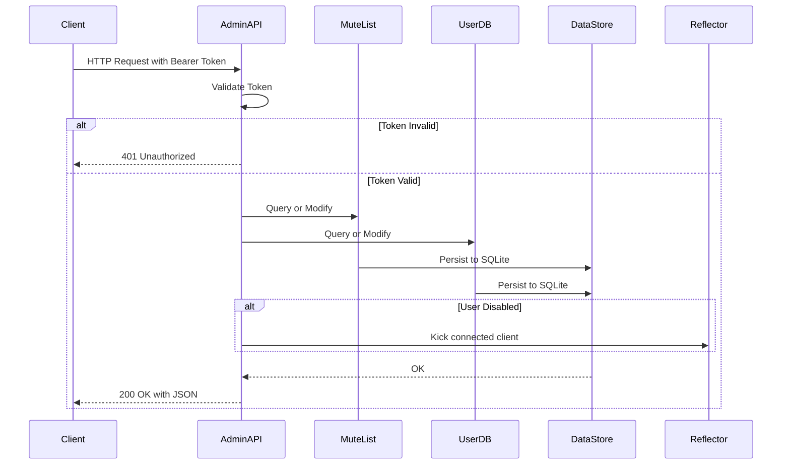

---

## 2. Authentication

### Bearer Token Authentication

All API endpoints require authentication via Bearer token in the HTTP
`Authorization` header.

```
Authorization: Bearer <your-api-token>
```

### Authentication Flow

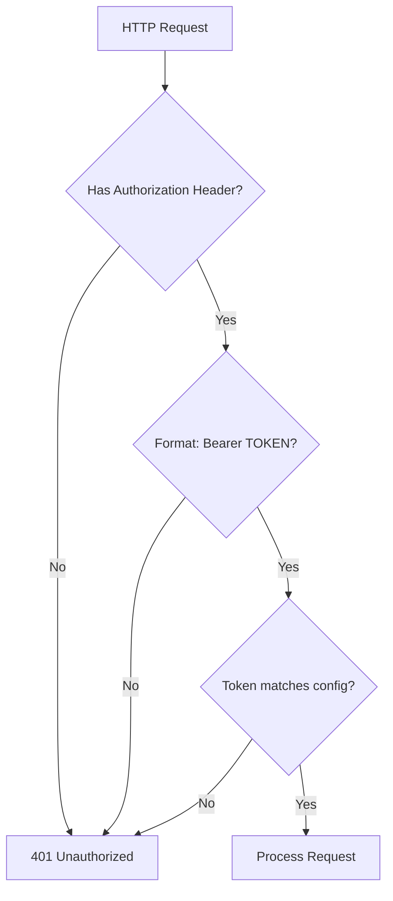

### Configuration

Set the API token in `svxreflector.conf`:

```ini
[GLOBAL]
ADMIN_API_TOKEN=your-secret-token-here
HTTP_SRV_PORT=8080
```

### Security Notes

```
+------------------------------------------------------------------+
|                     Security Considerations                       |
+------------------------------------------------------------------+
| - Use a strong, random token (min 32 characters recommended)     |
| - Transmit over HTTPS in production                              |
| - Token is compared case-sensitively                             |
| - No rate limiting (implement at reverse proxy if needed)        |
| - No token expiration (rotate manually in config)                |
+------------------------------------------------------------------+
```

---

## 3. Quick Reference

### Endpoint Summary

```
+--------+------------------------+----------------------------------+
| Method | Endpoint               | Description                      |
+--------+------------------------+----------------------------------+
| GET    | /admin/status          | Get reflector status             |
+--------+------------------------+----------------------------------+
| GET    | /admin/mute            | List all muted nodes             |
| POST   | /admin/mute            | Mute a node                      |
| POST   | /admin/unmute          | Unmute a node                    |
+--------+------------------------+----------------------------------+
| POST   | /admin/kick            | Kick a connected node            |
+--------+------------------------+----------------------------------+
| GET    | /admin/users           | List all users                   |
| GET    | /admin/users/{call}    | Get user details                 |
| POST   | /admin/users           | Create new user                  |
| PUT    | /admin/users/{call}    | Update user (auto-kick on disable)|
| DELETE | /admin/users/{call}    | Delete user                      |
+--------+------------------------+----------------------------------+
| GET    | /admin/config          | Get config (not implemented)     |
| POST   | /admin/config          | Set config (not implemented)     |
+--------+------------------------+----------------------------------+
```

### HTTP Status Codes

```
+------+-------------------------+------------------------------------+
| Code | Status                  | When Used                          |
+------+-------------------------+------------------------------------+
| 200  | OK                      | Successful GET/PUT/DELETE/POST     |
| 201  | Created                 | User created successfully          |
| 400  | Bad Request             | Invalid JSON or missing fields     |
| 401  | Unauthorized            | Invalid or missing token           |
| 404  | Not Found               | Resource does not exist            |
| 405  | Method Not Allowed      | Wrong HTTP method for endpoint     |
| 409  | Conflict                | Resource already exists            |
| 500  | Internal Server Error   | Server-side failure                |
| 501  | Not Implemented         | Feature not yet available          |
| 503  | Service Unavailable     | API disabled or DB not configured  |
+------+-------------------------+------------------------------------+
```

---

## 4. Endpoints

### 4.1 Status

#### GET /admin/status

Returns current reflector status including detailed information about connected nodes.
This endpoint is designed for building live dashboards and monitoring systems.

**Request:**
```http
GET /admin/status HTTP/1.1
Host: localhost:8080
Authorization: Bearer your-token
```

**Response (200 OK):**
```json
{
  "uptime": 0,
  "connected_nodes": 2,
  "muted_nodes": 1,
  "admin_api_version": "1.1",
  "nodes": [
    {
      "callsign": "SM0SVX",
      "id": 50079,
      "tg": 1,
      "monitored_tgs": [1, 2, 3],
      "proto_ver": "2.0",
      "ip": "192.168.1.100",
      "port": 56618,
      "is_blocked": false,
      "is_muted": false,
      "is_talker": true,
      "rx": {
        "A": {
          "siglev": 85,
          "sql_open": true,
          "active": true,
          "enabled": true
        }
      },
      "tx": {
        "A": {
          "transmit": false
        }
      },
      "qth_name": "Stockholm"
    },
    {
      "callsign": "SM0ABC-R",
      "id": 50080,
      "tg": 1,
      "monitored_tgs": [],
      "proto_ver": "2.0",
      "ip": "10.0.0.50",
      "port": 45123,
      "is_blocked": false,
      "is_muted": true,
      "is_talker": false,
      "rx": {
        "A": {
          "siglev": 0,
          "sql_open": false,
          "active": false,
          "enabled": true
        }
      },
      "tx": {
        "A": {
          "transmit": false
        }
      },
      "qth_name": "Gothenburg"
    }
  ]
}
```

**Response Fields:**

```
+-------------------+----------+------------------------------------------+
| Field             | Type     | Description                              |
+-------------------+----------+------------------------------------------+
| uptime            | integer  | Server uptime in seconds (TODO: always 0)|
| connected_nodes   | integer  | Number of currently connected nodes      |
| muted_nodes       | integer  | Number of entries in mute list           |
| admin_api_version | string   | API version string ("1.1")               |
| nodes             | array    | Array of node detail objects             |
+-------------------+----------+------------------------------------------+
```

**Node Detail Fields:**

```
+---------------+----------+------------------------------------------------+
| Field         | Type     | Description                                    |
+---------------+----------+------------------------------------------------+
| callsign      | string   | Node callsign                                  |
| id            | integer  | Unique client ID assigned by server            |
| tg            | integer  | Current talk group (0 if not selected)         |
| monitored_tgs | int[]    | Array of monitored talk group IDs              |
| proto_ver     | string   | Protocol version (e.g., "2.0")                 |
| ip            | string   | Remote IP address                              |
| port          | integer  | Remote TCP port                                |
| is_blocked    | boolean  | True if node is temporarily blocked from TX    |
|               |          | (SQL timeout protection, auto-expires)         |
| is_muted      | boolean  | True if node is in admin mute list             |
| is_talker     | boolean  | True if node is currently the active talker    |
| rx            | object   | Receiver status (see RX Status below)          |
| tx            | object   | Transmitter status (see TX Status below)       |
| qth_name      | string   | QTH name/location (if available)               |
+---------------+----------+------------------------------------------------+
```

**RX Status Object:**

The `rx` field contains receiver status for each receiver ID (A, B, C, etc.):

```json
{
  "rx": {
    "A": {
      "siglev": 85,
      "sql_open": true,
      "active": true,
      "enabled": true
    }
  }
}
```

```
+-------------+----------+------------------------------------------------+
| Field       | Type     | Description                                    |
+-------------+----------+------------------------------------------------+
| siglev      | integer  | Signal level (typically 0-100, unit depends    |
|             |          | on client configuration)                       |
| sql_open    | boolean  | True if squelch is open (signal detected)      |
| active      | boolean  | True if receiver is actively receiving         |
| enabled     | boolean  | True if receiver is enabled                    |
+-------------+----------+------------------------------------------------+
```

**TX Status Object:**

The `tx` field contains transmitter status for each transmitter ID:

```json
{
  "tx": {
    "A": {
      "transmit": true
    }
  }
}
```

```
+-------------+----------+------------------------------------------------+
| Field       | Type     | Description                                    |
+-------------+----------+------------------------------------------------+
| transmit    | boolean  | True if transmitter is currently transmitting  |
+-------------+----------+------------------------------------------------+
```

**Note on is_blocked vs is_muted:**

- `is_blocked`: Temporary automatic block due to SQL timeout protection.
  When a node holds squelch open too long, the server blocks it temporarily
  to prevent "stuck mic" situations. This auto-expires after configured time.
- `is_muted`: Administrative mute via Admin API. Node is explicitly muted
  by an administrator and remains muted until manually unmuted.

**Usage for Live Dashboard:**

The `/admin/status` endpoint provides all information needed for a real-time
monitoring dashboard:

```
+------------------------------------------------------------------+
|                    Dashboard Data Mapping                         |
+------------------------------------------------------------------+
| Dashboard Column  | API Field          | Notes                    |
+------------------------------------------------------------------+
| Callsign          | callsign           | Node identifier          |
| TG                | tg                 | Current talk group       |
| Monitored         | monitored_tgs      | Display as comma-sep     |
| Signal Level      | rx.{id}.siglev     | 0-100 signal strength    |
| Squelch           | rx.{id}.sql_open   | Squelch open indicator   |
| TX Status         | is_talker          | Active talker indicator  |
| Mute Status       | is_muted           | Admin muted              |
| Block Status      | is_blocked         | SQL timeout blocked      |
| Location          | qth_name           | QTH information          |
| IP                | ip                 | Remote address           |
+------------------------------------------------------------------+
```

---

### 4.2 Mute Management

#### GET /admin/mute

List all currently muted nodes (excludes expired entries).

**Request:**
```http
GET /admin/mute HTTP/1.1
Host: localhost:8080
Authorization: Bearer your-token
```

**Response (200 OK):**
```json
{
  "count": 2,
  "muted_nodes": [
    {
      "callsign": "SM0ABC",
      "reason": "Interference",
      "muted_at": 1701680000,
      "expires_at": 1701683600,
      "permanent": false
    },
    {
      "callsign": "SM0XYZ",
      "reason": "Admin decision",
      "muted_at": 1701670000,
      "expires_at": 0,
      "permanent": true
    }
  ]
}
```

**Response Fields (muted_nodes array):**

```
+-------------+----------+------------------------------------------------+
| Field       | Type     | Description                                    |
+-------------+----------+------------------------------------------------+
| callsign    | string   | Node callsign (normalized to uppercase)        |
| reason      | string   | Reason for muting                              |
| muted_at    | integer  | Unix timestamp when muted                      |
| expires_at  | integer  | Unix timestamp of expiry (0 = permanent)       |
| permanent   | boolean  | True if expires_at == 0                        |
+-------------+----------+------------------------------------------------+
```

---

#### POST /admin/mute

Mute a node (prevent audio transmission). Muted nodes can still connect and
receive audio, but their transmitted audio is dropped by the server.

**Request:**
```http
POST /admin/mute HTTP/1.1
Host: localhost:8080
Authorization: Bearer your-token
Content-Type: application/json

{
  "callsign": "SM0ABC",
  "duration": 3600,
  "reason": "Testing mute feature"
}
```

**Request Fields:**

```
+-----------+----------+----------+----------------------------------------+
| Field     | Type     | Required | Description                            |
+-----------+----------+----------+----------------------------------------+
| callsign  | string   | Yes      | Node callsign to mute                  |
| duration  | integer  | No       | Duration in seconds (omit = permanent) |
| reason    | string   | No       | Reason for muting (default: "Admin     |
|           |          |          | muted")                                |
+-----------+----------+----------+----------------------------------------+
```

**Response (200 OK):**
```json
{
  "success": true,
  "callsign": "SM0ABC",
  "message": "Node muted successfully"
}
```

**Error Responses:**

```
+------+-------------------+--------------------------------------------------+
| Code | Condition         | Response                                         |
+------+-------------------+--------------------------------------------------+
| 400  | Missing callsign  | {"error":"Missing or invalid 'callsign' field",  |
|      |                   |  "code":400}                                     |
+------+-------------------+--------------------------------------------------+
| 400  | Invalid JSON      | {"error":"Invalid JSON body","code":400}         |
+------+-------------------+--------------------------------------------------+
| 409  | Already muted     | {"error":"Node is already muted","code":409}     |
+------+-------------------+--------------------------------------------------+
```

---

#### POST /admin/unmute

Remove a node from the mute list.

**Request:**
```http
POST /admin/unmute HTTP/1.1
Host: localhost:8080
Authorization: Bearer your-token
Content-Type: application/json

{
  "callsign": "SM0ABC"
}
```

**Request Fields:**

```
+-----------+----------+----------+----------------------------------------+
| Field     | Type     | Required | Description                            |
+-----------+----------+----------+----------------------------------------+
| callsign  | string   | Yes      | Node callsign to unmute                |
+-----------+----------+----------+----------------------------------------+
```

**Response (200 OK):**
```json
{
  "success": true,
  "callsign": "SM0ABC",
  "message": "Node unmuted successfully"
}
```

**Error Responses:**

```
+------+-------------------+--------------------------------------------------+
| Code | Condition         | Response                                         |
+------+-------------------+--------------------------------------------------+
| 400  | Missing callsign  | {"error":"Missing or invalid 'callsign' field",  |
|      |                   |  "code":400}                                     |
+------+-------------------+--------------------------------------------------+
| 400  | Invalid JSON      | {"error":"Invalid JSON body","code":400}         |
+------+-------------------+--------------------------------------------------+
| 404  | Not muted         | {"error":"Node not found in mute list",          |
|      |                   |  "code":404}                                     |
+------+-------------------+--------------------------------------------------+
```

---

### 4.3 Node Management

#### POST /admin/kick

Disconnect a currently connected node. The server sends an ERROR message
to the client, then closes the connection after 10 seconds (m_disc_timer).

**Request:**
```http
POST /admin/kick HTTP/1.1
Host: localhost:8080
Authorization: Bearer your-token
Content-Type: application/json

{
  "callsign": "SM0ABC",
  "reason": "Maintenance"
}
```

**Request Fields:**

```
+-----------+----------+----------+------------------------------------------+
| Field     | Type     | Required | Description                              |
+-----------+----------+----------+------------------------------------------+
| callsign  | string   | Yes      | Node callsign to kick                    |
| reason    | string   | No       | Reason for kicking                       |
|           |          |          | (default: "Kicked by admin")             |
+-----------+----------+----------+------------------------------------------+
```

**Response (200 OK):**
```json
{
  "success": true,
  "message": "Node SM0ABC has been kicked",
  "callsign": "SM0ABC",
  "reason": "Maintenance"
}
```

**Error Responses:**

```
+------+-------------------+--------------------------------------------------+
| Code | Condition         | Response                                         |
+------+-------------------+--------------------------------------------------+
| 400  | Missing callsign  | {"error":"Missing required field: callsign",     |
|      |                   |  "code":400}                                     |
+------+-------------------+--------------------------------------------------+
| 400  | Invalid JSON      | {"error":"Invalid JSON body","code":400}         |
+------+-------------------+--------------------------------------------------+
| 404  | Not connected     | {"error":"Node not found: SM0ABC","code":404}    |
+------+-------------------+--------------------------------------------------+
```

**Kick Behavior:**

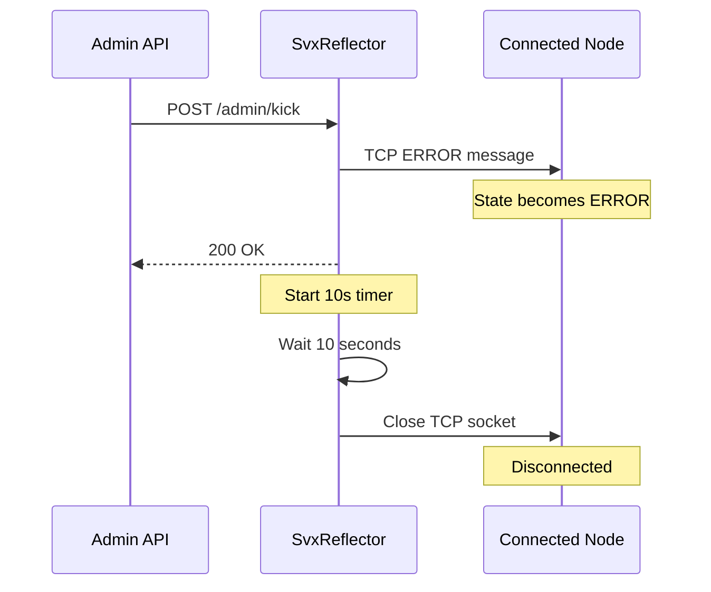

---

### 4.4 User Management

User management requires `ADMIN_MUTE_FILE` configuration for SQLite persistence.

**Important:** When a user is disabled via PUT, the server automatically kicks
them if they are currently connected.

#### GET /admin/users

List all users (from database and config).

**Request:**
```http
GET /admin/users HTTP/1.1
Host: localhost:8080
Authorization: Bearer your-token
```

**Response (200 OK):**
```json
{
  "count": 2,
  "users": [
    {
      "callsign": "SM0SVX",
      "group": "admins",
      "enabled": true,
      "created_at": 1701600000,
      "updated_at": 1701600000,
      "last_seen": 1701650000,
      "login_count": 15,
      "metadata": {"email": "sm0svx@example.com"},
      "source": "database"
    },
    {
      "callsign": "SM0ABC",
      "group": "operators",
      "enabled": true,
      "created_at": 0,
      "updated_at": 0,
      "last_seen": 0,
      "login_count": 0,
      "metadata": {},
      "source": "config"
    }
  ]
}
```

**Error Response:**

```
+------+-------------------+--------------------------------------------------+
| Code | Condition         | Response                                         |
+------+-------------------+--------------------------------------------------+
| 503  | DB not configured | {"error":"User database not configured",         |
|      |                   |  "code":503}                                     |
+------+-------------------+--------------------------------------------------+
```

---

#### GET /admin/users/{callsign}

Get details for a specific user.

**Request:**
```http
GET /admin/users/SM0SVX HTTP/1.1
Host: localhost:8080
Authorization: Bearer your-token
```

**Response (200 OK):**
```json
{
  "callsign": "SM0SVX",
  "group": "admins",
  "enabled": true,
  "created_at": 1701600000,
  "updated_at": 1701600000,
  "last_seen": 1701650000,
  "login_count": 15,
  "metadata": {"email": "sm0svx@example.com"},
  "source": "database"
}
```

**Error Responses:**

```
+------+-------------------+--------------------------------------------------+
| Code | Condition         | Response                                         |
+------+-------------------+--------------------------------------------------+
| 404  | User not found    | {"error":"User not found: SM0SVX","code":404}    |
+------+-------------------+--------------------------------------------------+
| 503  | DB not configured | {"error":"User database not configured",         |
|      |                   |  "code":503}                                     |
+------+-------------------+--------------------------------------------------+
```

---

#### POST /admin/users

Create a new user.

**Request:**
```http
POST /admin/users HTTP/1.1
Host: localhost:8080
Authorization: Bearer your-token
Content-Type: application/json

{
  "callsign": "SM0NEW",
  "group": "operators",
  "password": "secure-password-123",
  "enabled": true,
  "metadata": {
    "email": "sm0new@example.com",
    "notes": "New operator"
  }
}
```

**Request Fields:**

```
+-----------+----------+----------+------------------------------------------+
| Field     | Type     | Required | Description                              |
+-----------+----------+----------+------------------------------------------+
| callsign  | string   | Yes      | User callsign (primary key)              |
| group     | string   | Yes      | Password group name                      |
| password  | string   | Yes      | User password (stored as-is, not hashed) |
| enabled   | boolean  | No       | Enable/disable user (default: true)      |
| metadata  | object   | No       | Custom metadata (default: empty object)  |
+-----------+----------+----------+------------------------------------------+
```

**Response (201 Created):**
```json
{
  "success": true,
  "message": "User created successfully",
  "user": {
    "callsign": "SM0NEW",
    "group": "operators",
    "enabled": true,
    "created_at": 1701680000,
    "updated_at": 1701680000,
    "last_seen": 0,
    "login_count": 0,
    "metadata": {"email": "sm0new@example.com", "notes": "New operator"},
    "source": "database"
  }
}
```

**Error Responses:**

```
+------+-------------------+--------------------------------------------------+
| Code | Condition         | Response                                         |
+------+-------------------+--------------------------------------------------+
| 400  | Missing callsign  | {"error":"Missing or invalid 'callsign' field",  |
|      |                   |  "code":400}                                     |
+------+-------------------+--------------------------------------------------+
| 400  | Missing group     | {"error":"Missing or invalid 'group' field",     |
|      |                   |  "code":400}                                     |
+------+-------------------+--------------------------------------------------+
| 400  | Missing password  | {"error":"Missing or invalid 'password' field",  |
|      |                   |  "code":400}                                     |
+------+-------------------+--------------------------------------------------+
| 400  | Invalid JSON      | {"error":"Invalid JSON body","code":400}         |
+------+-------------------+--------------------------------------------------+
| 409  | User exists       | {"error":"User already exists: SM0NEW",          |
|      |                   |  "code":409}                                     |
+------+-------------------+--------------------------------------------------+
| 503  | DB not configured | {"error":"User database not configured",         |
|      |                   |  "code":503}                                     |
+------+-------------------+--------------------------------------------------+
```

---

#### PUT /admin/users/{callsign}

Update an existing user (partial update supported).

**IMPORTANT:** When setting `enabled: false`, the server automatically kicks
the user if they are currently connected.

**Request:**
```http
PUT /admin/users/SM0SVX HTTP/1.1
Host: localhost:8080
Authorization: Bearer your-token
Content-Type: application/json

{
  "enabled": false,
  "metadata": {"suspended": true, "reason": "Inactive"}
}
```

**Request Fields (all optional):**

```
+-----------+----------+------------------------------------------------+
| Field     | Type     | Description                                    |
+-----------+----------+------------------------------------------------+
| group     | string   | Update password group                          |
| password  | string   | Update password                                |
| enabled   | boolean  | Enable/disable user (auto-kicks if false)      |
| metadata  | object   | Merge with existing metadata                   |
+-----------+----------+------------------------------------------------+
```

**Response (200 OK):**
```json
{
  "success": true,
  "message": "User updated successfully",
  "user": {
    "callsign": "SM0SVX",
    "group": "admins",
    "enabled": false,
    "created_at": 1701600000,
    "updated_at": 1701680000,
    "last_seen": 1701650000,
    "login_count": 15,
    "metadata": {
      "email": "sm0svx@example.com",
      "suspended": true,
      "reason": "Inactive"
    },
    "source": "database"
  }
}
```

**Response when user was kicked:**
```json
{
  "success": true,
  "message": "User disabled and kicked",
  "user": { ... }
}
```

**Error Responses:**

```
+------+-------------------+--------------------------------------------------+
| Code | Condition         | Response                                         |
+------+-------------------+--------------------------------------------------+
| 400  | Invalid JSON      | {"error":"Invalid JSON body","code":400}         |
+------+-------------------+--------------------------------------------------+
| 404  | User not found    | {"error":"User not found: SM0SVX","code":404}    |
+------+-------------------+--------------------------------------------------+
| 500  | Update failed     | {"error":"Failed to update user: SM0SVX",        |
|      |                   |  "code":500}                                     |
+------+-------------------+--------------------------------------------------+
| 503  | DB not configured | {"error":"User database not configured",         |
|      |                   |  "code":503}                                     |
+------+-------------------+--------------------------------------------------+
```

**Auto-Kick on Disable Flow:**

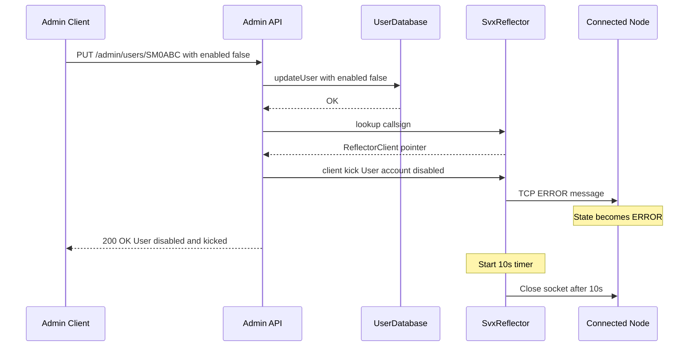

---

#### DELETE /admin/users/{callsign}

Delete a user from the database.

**Request:**
```http
DELETE /admin/users/SM0OLD HTTP/1.1
Host: localhost:8080
Authorization: Bearer your-token
```

**Response (200 OK):**
```json
{
  "success": true,
  "message": "User deleted successfully",
  "callsign": "SM0OLD"
}
```

**Error Responses:**

```
+------+-------------------+--------------------------------------------------+
| Code | Condition         | Response                                         |
+------+-------------------+--------------------------------------------------+
| 404  | User not found    | {"error":"User not found: SM0OLD","code":404}    |
+------+-------------------+--------------------------------------------------+
| 503  | DB not configured | {"error":"User database not configured",         |
|      |                   |  "code":503}                                     |
+------+-------------------+--------------------------------------------------+
```

---

## 5. Data Models

### MuteEntry

Represents a muted node entry.

```
+-------------+----------+------------------------------------------------+
| Field       | Type     | Description                                    |
+-------------+----------+------------------------------------------------+
| callsign    | string   | Node callsign (normalized to uppercase)        |
| reason      | string   | Reason for muting                              |
| muted_at    | integer  | Unix timestamp when muted                      |
| expires_at  | integer  | Unix timestamp of expiry (0 = permanent)       |
| permanent   | boolean  | True if expires_at == 0                        |
+-------------+----------+------------------------------------------------+
```

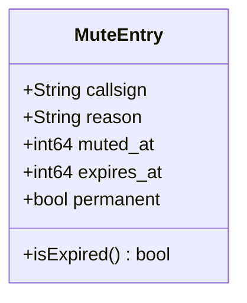

### UserEntry

Represents a user account.

```
+-------------+----------+------------------------------------------------+
| Field       | Type     | Description                                    |
+-------------+----------+------------------------------------------------+
| callsign    | string   | User callsign (primary key)                    |
| group       | string   | Password group name                            |
| enabled     | boolean  | Whether user can authenticate                  |
| created_at  | integer  | Unix timestamp of creation                     |
| updated_at  | integer  | Unix timestamp of last modification            |
| last_seen   | integer  | Unix timestamp of last login (0 = never)       |
| login_count | integer  | Total number of logins                         |
| metadata    | object   | Custom JSON metadata                           |
| source      | string   | "config" or "database"                         |
+-------------+----------+------------------------------------------------+
```

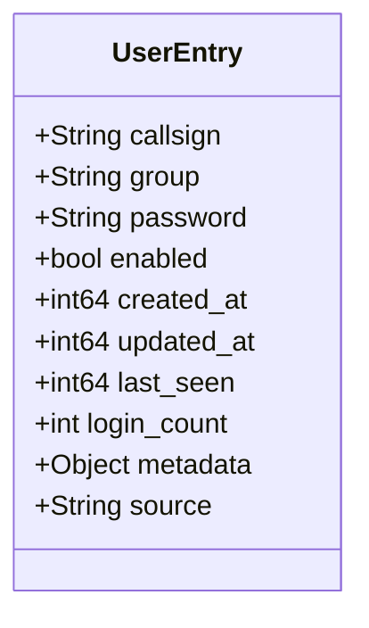

### Source Types

```
+------------+---------------------------------------------------------------+
| Source     | Description                                                   |
+------------+---------------------------------------------------------------+
| "config"   | User loaded from svxreflector.conf [USERS]/[PASSWORDS]        |
| "database" | User created via API or stored in SQLite                      |
+------------+---------------------------------------------------------------+
```

---

## 6. Error Handling

### Standard Error Response

All errors return JSON with consistent structure:

```json
{
  "error": "Human-readable error message",
  "code": 400
}
```

### Error Response Fields

```
+-----------+----------+------------------------------------------------+
| Field     | Type     | Description                                    |
+-----------+----------+------------------------------------------------+
| error     | string   | Descriptive error message                      |
| code      | integer  | HTTP status code (same as response status)     |
+-----------+----------+------------------------------------------------+
```

### Common Error Scenarios

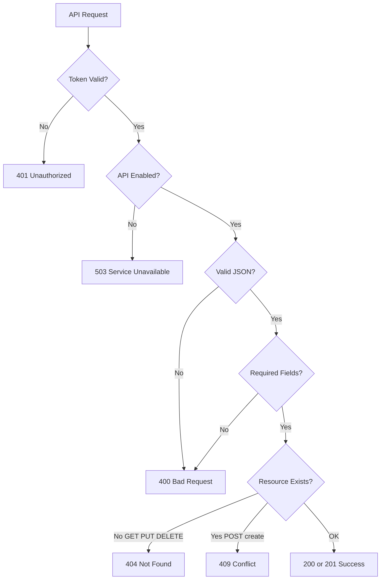

---

## 7. Configuration

### Required Settings

```ini
[GLOBAL]
# HTTP server port (required for Admin API)
HTTP_SRV_PORT=8080

# API authentication token (required to enable Admin API)
# If empty or not set, all API requests return 503
ADMIN_API_TOKEN=your-secret-token-here
```

### Optional Settings

```ini
[GLOBAL]
# SQLite database file for persistence (required for user management)
# Used for both mute list and user database
ADMIN_MUTE_FILE=/var/lib/svxlink/reflector.db
```

### User Configuration (Alternative to API)

Users can also be defined in configuration:

```ini
[USERS]
SM0SVX=admin_group
SM0ABC=operator_group

[PASSWORDS]
admin_group=secret_admin_password
operator_group=operator_password_123
```

### Configuration Priority

```
+-------+-------------------------+-------------------------------------+
| Order | Source                  | Notes                               |
+-------+-------------------------+-------------------------------------+
| 1     | Database (source=db)    | Created/modified via API            |
| 2     | Config (source=config)  | Loaded from [USERS]/[PASSWORDS]     |
+-------+-------------------------+-------------------------------------+
```

---

## 8. Architecture

### Component Overview

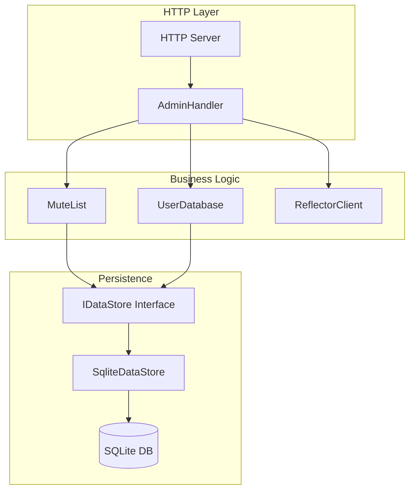

### Class Relationships

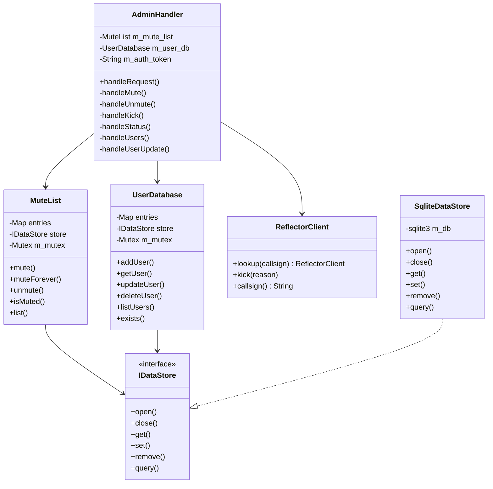

### Thread Safety

```
+------------------+---------------+------------------------------------+
| Component        | Thread Safe   | Mechanism                          |
+------------------+---------------+------------------------------------+
| AdminHandler     | Yes           | Called from single HTTP thread     |
| MuteList         | Yes           | Internal std::mutex                |
| UserDatabase     | Yes           | Internal std::mutex                |
| SqliteDataStore  | Yes           | SQLite serialized mode + mutex     |
| ReflectorClient  | Yes           | Static lookup with mutex           |
+------------------+---------------+------------------------------------+
```

### Data Flow: Mute Operation

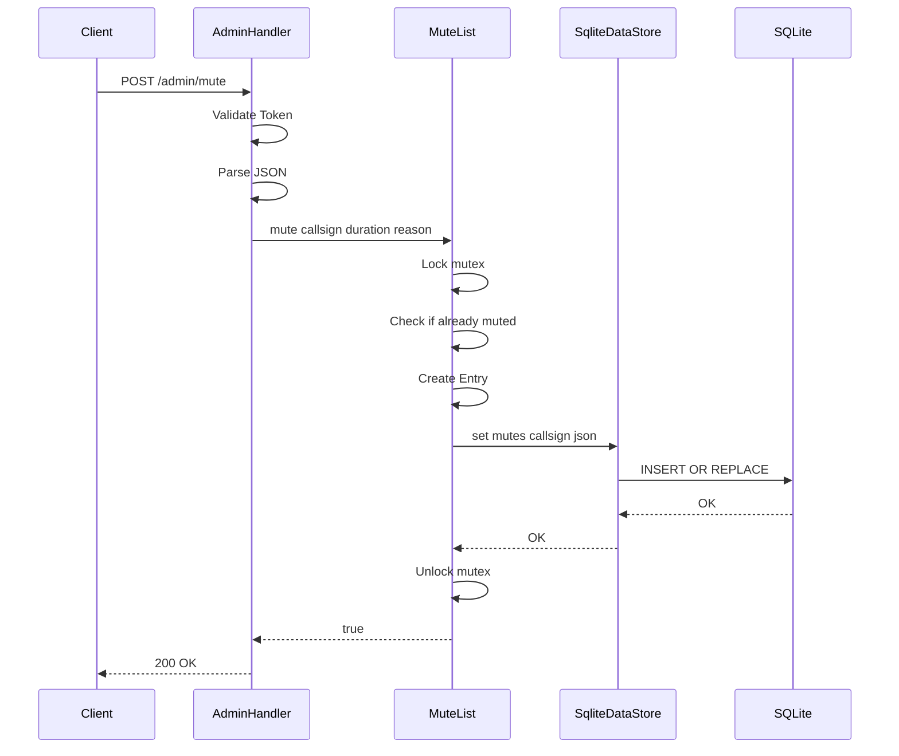

### Data Flow: User Disable with Auto-Kick

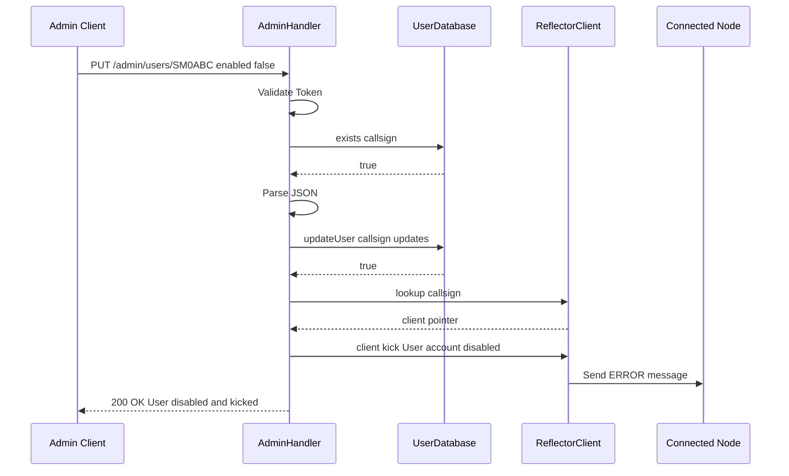

---

## 9. Examples

### Complete Workflow: Managing a Problematic Node

```bash
#!/bin/bash
# Example: Managing a problematic node

API_URL="http://localhost:8080"
TOKEN="your-api-token"

# 1. Check current status (API v1.1 returns detailed node info)
echo "=== Current Status ==="
curl -s -X GET "$API_URL/admin/status" \
  -H "Authorization: Bearer $TOKEN" | jq .

# 2. Check connected nodes with details
echo -e "\n=== Connected Nodes (detailed) ==="
curl -s -X GET "$API_URL/admin/status" \
  -H "Authorization: Bearer $TOKEN" | jq '.nodes[] | {callsign, tg, is_muted, is_talker, ip}'

# 3. List only callsigns
echo -e "\n=== Node Callsigns ==="
curl -s -X GET "$API_URL/admin/status" \
  -H "Authorization: Bearer $TOKEN" | jq -r '.nodes[].callsign'

# 4. Mute the problematic node for 1 hour
echo -e "\n=== Muting Node ==="
curl -s -X POST "$API_URL/admin/mute" \
  -H "Authorization: Bearer $TOKEN" \
  -H "Content-Type: application/json" \
  -d '{
    "callsign": "SM0ABC",
    "duration": 3600,
    "reason": "Audio interference reported"
  }' | jq .

# 5. Verify mute list
echo -e "\n=== Mute List ==="
curl -s -X GET "$API_URL/admin/mute" \
  -H "Authorization: Bearer $TOKEN" | jq .

# 6. If needed, kick the node
echo -e "\n=== Kicking Node ==="
curl -s -X POST "$API_URL/admin/kick" \
  -H "Authorization: Bearer $TOKEN" \
  -H "Content-Type: application/json" \
  -d '{
    "callsign": "SM0ABC",
    "reason": "Please check your audio settings"
  }' | jq .

# 7. Later, unmute the node
echo -e "\n=== Unmuting Node ==="
curl -s -X POST "$API_URL/admin/unmute" \
  -H "Authorization: Bearer $TOKEN" \
  -H "Content-Type: application/json" \
  -d '{"callsign": "SM0ABC"}' | jq .
```

### User Management Example

```bash
#!/bin/bash
# Example: User CRUD operations

API_URL="http://localhost:8080"
TOKEN="your-api-token"

# Create a new user
echo "=== Create User ==="
curl -s -X POST "$API_URL/admin/users" \
  -H "Authorization: Bearer $TOKEN" \
  -H "Content-Type: application/json" \
  -d '{
    "callsign": "SM0NEW",
    "group": "operators",
    "password": "secure123",
    "metadata": {"email": "sm0new@example.com"}
  }' | jq .

# Get user details
echo -e "\n=== Get User ==="
curl -s -X GET "$API_URL/admin/users/SM0NEW" \
  -H "Authorization: Bearer $TOKEN" | jq .

# Update user (this will auto-kick if user is connected)
echo -e "\n=== Disable User (auto-kicks if connected) ==="
curl -s -X PUT "$API_URL/admin/users/SM0NEW" \
  -H "Authorization: Bearer $TOKEN" \
  -H "Content-Type: application/json" \
  -d '{
    "enabled": false,
    "metadata": {"disabled_reason": "Account review"}
  }' | jq .

# Re-enable user
echo -e "\n=== Re-enable User ==="
curl -s -X PUT "$API_URL/admin/users/SM0NEW" \
  -H "Authorization: Bearer $TOKEN" \
  -H "Content-Type: application/json" \
  -d '{"enabled": true}' | jq .

# List all users
echo -e "\n=== List Users ==="
curl -s -X GET "$API_URL/admin/users" \
  -H "Authorization: Bearer $TOKEN" | jq .

# Delete user
echo -e "\n=== Delete User ==="
curl -s -X DELETE "$API_URL/admin/users/SM0NEW" \
  -H "Authorization: Bearer $TOKEN" | jq .
```

### Python Client Example

```python
#!/usr/bin/env python3
"""SvxReflector Admin API Client Example"""

import requests
from typing import Optional, Dict, Any

class SvxReflectorAdmin:
    """Simple client for SvxReflector Admin API"""

    def __init__(self, base_url: str, token: str):
        self.base_url = base_url.rstrip('/')
        self.headers = {
            'Authorization': f'Bearer {token}',
            'Content-Type': 'application/json'
        }

    def get_status(self) -> Dict[str, Any]:
        """Get reflector status"""
        r = requests.get(f'{self.base_url}/admin/status', headers=self.headers)
        r.raise_for_status()
        return r.json()

    def list_muted(self) -> Dict[str, Any]:
        """List all muted nodes"""
        r = requests.get(f'{self.base_url}/admin/mute', headers=self.headers)
        r.raise_for_status()
        return r.json()

    def mute(self, callsign: str, duration: Optional[int] = None,
             reason: str = '') -> Dict[str, Any]:
        """Mute a node"""
        data = {'callsign': callsign, 'reason': reason}
        if duration is not None:
            data['duration'] = duration
        r = requests.post(f'{self.base_url}/admin/mute',
                         headers=self.headers, json=data)
        r.raise_for_status()
        return r.json()

    def unmute(self, callsign: str) -> Dict[str, Any]:
        """Unmute a node"""
        r = requests.post(f'{self.base_url}/admin/unmute',
                         headers=self.headers, json={'callsign': callsign})
        r.raise_for_status()
        return r.json()

    def kick(self, callsign: str,
             reason: str = 'Kicked by admin') -> Dict[str, Any]:
        """Kick a connected node"""
        r = requests.post(f'{self.base_url}/admin/kick',
                         headers=self.headers,
                         json={'callsign': callsign, 'reason': reason})
        r.raise_for_status()
        return r.json()

    def list_users(self) -> Dict[str, Any]:
        """List all users"""
        r = requests.get(f'{self.base_url}/admin/users', headers=self.headers)
        r.raise_for_status()
        return r.json()

    def get_user(self, callsign: str) -> Dict[str, Any]:
        """Get user details"""
        r = requests.get(f'{self.base_url}/admin/users/{callsign}',
                        headers=self.headers)
        r.raise_for_status()
        return r.json()

    def create_user(self, callsign: str, group: str, password: str,
                    enabled: bool = True,
                    metadata: Optional[Dict] = None) -> Dict[str, Any]:
        """Create a new user"""
        data = {
            'callsign': callsign,
            'group': group,
            'password': password,
            'enabled': enabled,
            'metadata': metadata or {}
        }
        r = requests.post(f'{self.base_url}/admin/users',
                         headers=self.headers, json=data)
        r.raise_for_status()
        return r.json()

    def update_user(self, callsign: str, **kwargs) -> Dict[str, Any]:
        """
        Update user (partial update)

        Note: Setting enabled=False will auto-kick the user if connected
        """
        r = requests.put(f'{self.base_url}/admin/users/{callsign}',
                        headers=self.headers, json=kwargs)
        r.raise_for_status()
        return r.json()

    def delete_user(self, callsign: str) -> Dict[str, Any]:
        """Delete a user"""
        r = requests.delete(f'{self.base_url}/admin/users/{callsign}',
                           headers=self.headers)
        r.raise_for_status()
        return r.json()

    def disable_user(self, callsign: str, reason: str = '') -> Dict[str, Any]:
        """
        Disable a user (will auto-kick if connected)
        """
        metadata = {'disabled_reason': reason} if reason else {}
        return self.update_user(callsign, enabled=False, metadata=metadata)

    def enable_user(self, callsign: str) -> Dict[str, Any]:
        """Enable a user"""
        return self.update_user(callsign, enabled=True)


# Usage example
if __name__ == '__main__':
    client = SvxReflectorAdmin('http://localhost:8080', 'your-token')

    # Get detailed status (API v1.1)
    status = client.get_status()
    print(f"API Version: {status['admin_api_version']}")
    print(f"Connected nodes: {status['connected_nodes']}")
    print(f"Muted nodes: {status['muted_nodes']}")

    # Display detailed node information for dashboard
    print("\n--- Connected Nodes ---")
    print(f"{'Callsign':<12} {'TG':<6} {'Monitored':<15} {'Status':<10} {'IP':<15}")
    print("-" * 60)
    for node in status['nodes']:
        monitored = ','.join(str(tg) for tg in node['monitored_tgs'])
        status_str = 'MUTED' if node['is_muted'] else 'TX' if node['is_talker'] else 'RX' if node.get('rx') else 'IDLE'
        print(f"{node['callsign']:<12} {node['tg']:<6} {monitored:<15} {status_str:<10} {node['ip']:<15}")

    # Mute a node for 1 hour
    result = client.mute('SM0ABC', duration=3600, reason='Testing')
    print(f"\nMute result: {result}")

    # Create a user
    user = client.create_user(
        callsign='SM0NEW',
        group='operators',
        password='secret123',
        metadata={'email': 'sm0new@example.com'}
    )
    print(f"Created user: {user}")

    # Disable user (auto-kicks if connected)
    result = client.disable_user('SM0NEW', reason='Account review')
    print(f"Disable result: {result}")
```

---

## 10. Troubleshooting

### Common Issues

```
+-----------------------------------+----------------------------------------+
| Symptom                           | Solution                               |
+-----------------------------------+----------------------------------------+
| 503 Service Unavailable           | Set ADMIN_API_TOKEN in config          |
+-----------------------------------+----------------------------------------+
| 401 Unauthorized                  | Check token format: "Bearer <token>"   |
|                                   | Verify token matches config exactly    |
+-----------------------------------+----------------------------------------+
| 503 User database not configured  | Set ADMIN_MUTE_FILE for SQLite path    |
+-----------------------------------+----------------------------------------+
| Connection refused                | Check HTTP_SRV_PORT is set and open    |
+-----------------------------------+----------------------------------------+
| User changes not persisting       | Ensure ADMIN_MUTE_FILE is writable     |
+-----------------------------------+----------------------------------------+
| Node not found on kick            | Node must be currently connected       |
+-----------------------------------+----------------------------------------+
| Disabled user can still connect   | Check if user exists in [USERS] config |
|                                   | Config users override database         |
+-----------------------------------+----------------------------------------+
```

### Debug Checklist

```
1. [ ] svxreflector is running
2. [ ] HTTP_SRV_PORT is configured and not blocked by firewall
3. [ ] ADMIN_API_TOKEN is set (non-empty)
4. [ ] Authorization header format is correct
5. [ ] Content-Type is application/json for POST/PUT
6. [ ] JSON body is valid
7. [ ] Required fields are present
8. [ ] ADMIN_MUTE_FILE path exists and is writable (for persistence)
9. [ ] User is not defined in config file (config overrides database)
```

### Log Messages

Check svxreflector logs for:

```
MuteList: Muted SM0ABC for 3600 seconds - Testing
MuteList: Unmuted SM0ABC
MuteList: Loaded 5 entries from data store
MuteList: Expired mute removed for SM0OLD
UserDatabase: Created user SM0NEW
UserDatabase: Updated user SM0SVX
UserDatabase: Deleted user SM0OLD
SM0ABC: Kicking client - User account disabled
SM0ABC: Kicked (account disabled via API)
```

---

## 11. Test Coverage

The Admin API is tested with 91 automated tests:

### Admin API Tests (53 tests)

```
+-----------------------------------+-------+
| Category                          | Tests |
+-----------------------------------+-------+
| Authentication                    |   3   |
| GET /admin/status                 |   4   |
| POST /admin/mute (temporary)      |   3   |
| POST /admin/mute (forever)        |   1   |
| GET /admin/mute (list)            |   6   |
| POST /admin/mute (validation)     |   2   |
| POST /admin/unmute                |   4   |
| POST /admin/kick                  |   2   |
| /admin/config (stub)              |   2   |
| Method Not Allowed                |   2   |
| Not Found                         |   1   |
| GET /admin/users (list)           |   3   |
| POST /admin/users (create)        |   8   |
| GET /admin/users/{callsign}       |   5   |
| PUT /admin/users/{callsign}       |   4   |
| DELETE /admin/users/{callsign}    |   3   |
+-----------------------------------+-------+
| Total                             |  53   |
+-----------------------------------+-------+
```

### Client Integration Tests (38 tests)

```
+-----------------------------------+-------+
| Category                          | Tests |
+-----------------------------------+-------+
| Basic Connection                  |   3   |
| Authentication Failure            |   2   |
| Disabled User                     |   1   |
| Realtime User Toggle              |   5   |
| Mute API Enforcement              |   7   |
| Real Audio Mute Enforcement       |   8   |
| Realtime Mute                     |   4   |
| Unknown User                      |   1   |
| Multiple Connections              |   2   |
| Auto-Kick on Disable              |   5   |
+-----------------------------------+-------+
| Total                             |  38   |
+-----------------------------------+-------+
```

### Running Tests

```bash
# Run all tests in Docker
cd tests/admin-api
./docker-test.sh

# Run API tests only
python3 test_admin_api.py --host localhost --port 8080 --token your-token

# Run client integration tests
python3 client_test.py --reflector-host localhost --reflector-port 5300 \
                       --admin-host localhost --admin-port 8080 \
                       --admin-token your-token
```

---

## Appendix A: API Version History

```
+----------+------------+--------------------------------------------------+
| Version  | Date       | Changes                                          |
+----------+------------+--------------------------------------------------+
| 1.1      | 2025-12    | Enhanced status endpoint                         |
|          |            | - Detailed node info in /admin/status            |
|          |            | - Added: id, tg, monitored_tgs, proto_ver        |
|          |            | - Added: ip, port, is_blocked, is_muted          |
|          |            | - Added: is_talker, rx, tx, qth_name             |
|          |            | - Designed for live dashboard integration        |
+----------+------------+--------------------------------------------------+
| 1.0      | 2025-12    | Initial release                                  |
|          |            | - Mute/unmute/kick endpoints                     |
|          |            | - Status endpoint (callsign list only)           |
|          |            | - User CRUD endpoints                            |
|          |            | - SQLite persistence                             |
|          |            | - Auto-kick on user disable                      |
|          |            | - Real UDP audio mute enforcement                |
+----------+------------+--------------------------------------------------+
```

## Appendix B: Related Files

```
+----------------------------------------------+------------------------------+
| File                                         | Description                  |
+----------------------------------------------+------------------------------+
| src/svxlink/reflector/AdminHandler.h         | API handler header           |
| src/svxlink/reflector/AdminHandler.cpp       | API handler implementation   |
| src/svxlink/reflector/MuteList.h             | Mute list header             |
| src/svxlink/reflector/MuteList.cpp           | Mute list implementation     |
| src/svxlink/reflector/UserDatabase.h         | User database header         |
| src/svxlink/reflector/UserDatabase.cpp       | User database implementation |
| src/svxlink/reflector/DataStore.h            | Data store interface         |
| src/svxlink/reflector/SqliteDataStore.h      | SQLite implementation header |
| src/svxlink/reflector/SqliteDataStore.cpp    | SQLite implementation        |
| src/svxlink/reflector/ReflectorClient.cpp    | Client kick implementation   |
| tests/admin-api/test_admin_api.py            | API test suite               |
| tests/admin-api/client_test.py               | Client integration tests     |
| tests/admin-api/svxlink_client.py            | Python reflector client      |
| tests/admin-api/svxlink_audio.py             | UDP audio module             |
+----------------------------------------------+------------------------------+
```

## Appendix C: SvxLink Protocol Notes

### Connection Limits

- Only ONE session per callsign is allowed
- Second connection from same callsign will be rejected or kick the first

### Mute Behavior

- Muted nodes can still connect and receive audio
- Muted nodes' transmitted UDP audio is dropped by server
- Mute does not disconnect the node

### Kick Behavior

- Server sends TCP ERROR message immediately
- Server waits 10 seconds (m_disc_timer) before closing socket
- Client should transition to ERROR state upon receiving ERROR message

---

*This document is machine-readable and optimized for both human readers and
LLM parsing.*
